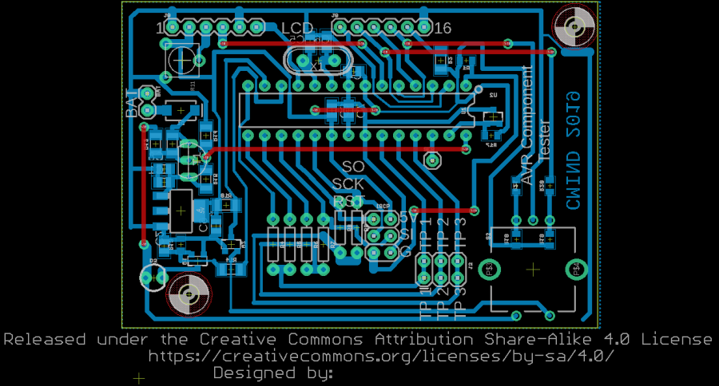
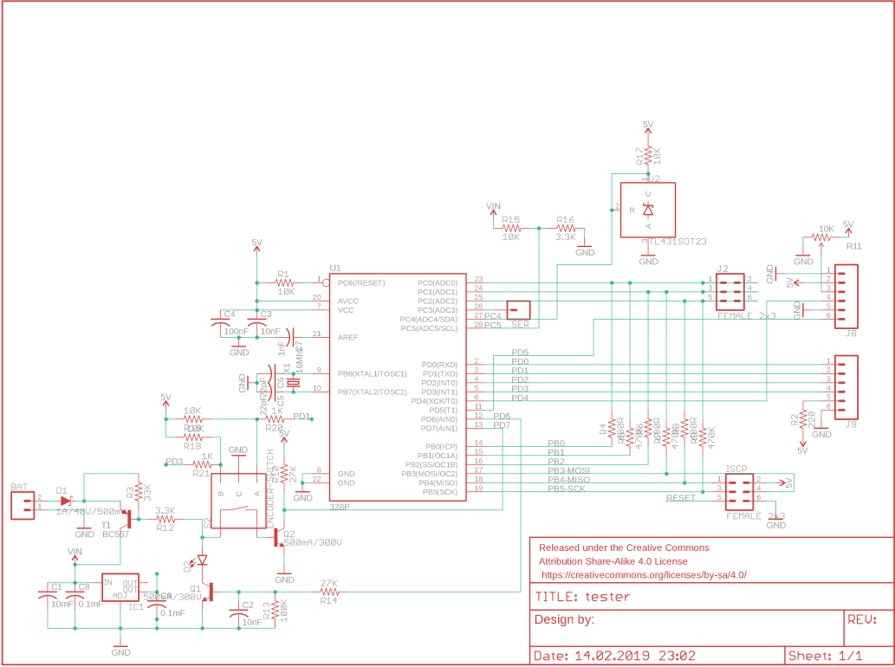
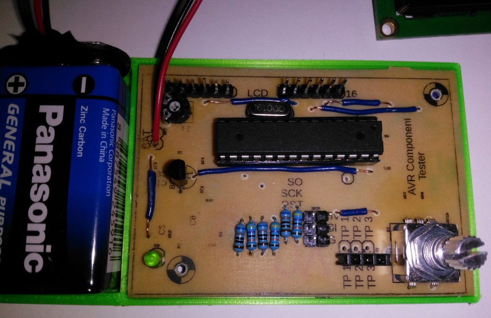
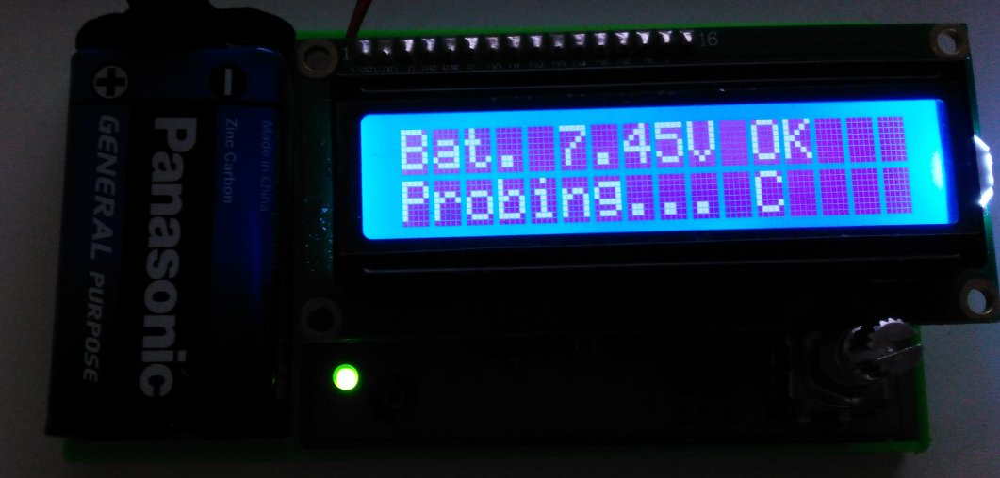

# AVR_Component_Tester
DIY single sided PCB for AVR Component Tester (based on pdf file by Karl-Heinz Kübbeler)

A very useful gadget whether you buy from many clones or built yourself. Here is my version:

pcb</img>

schematic</img>

photos of built device:
without 2x16 lcd screen</img>

screen installed and working</img>